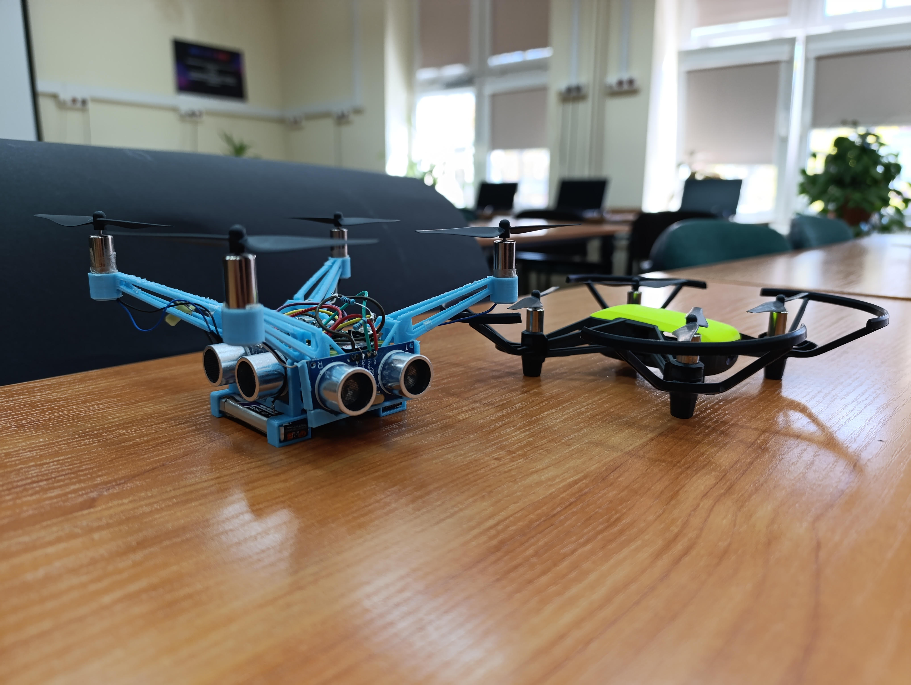
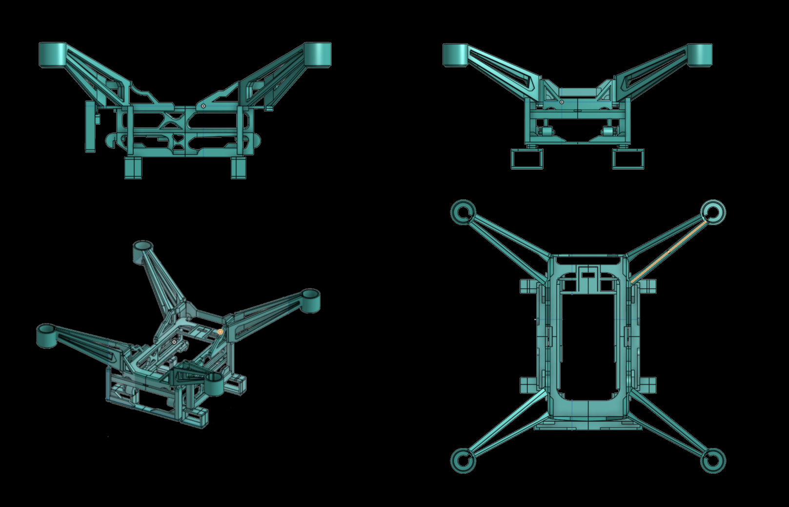
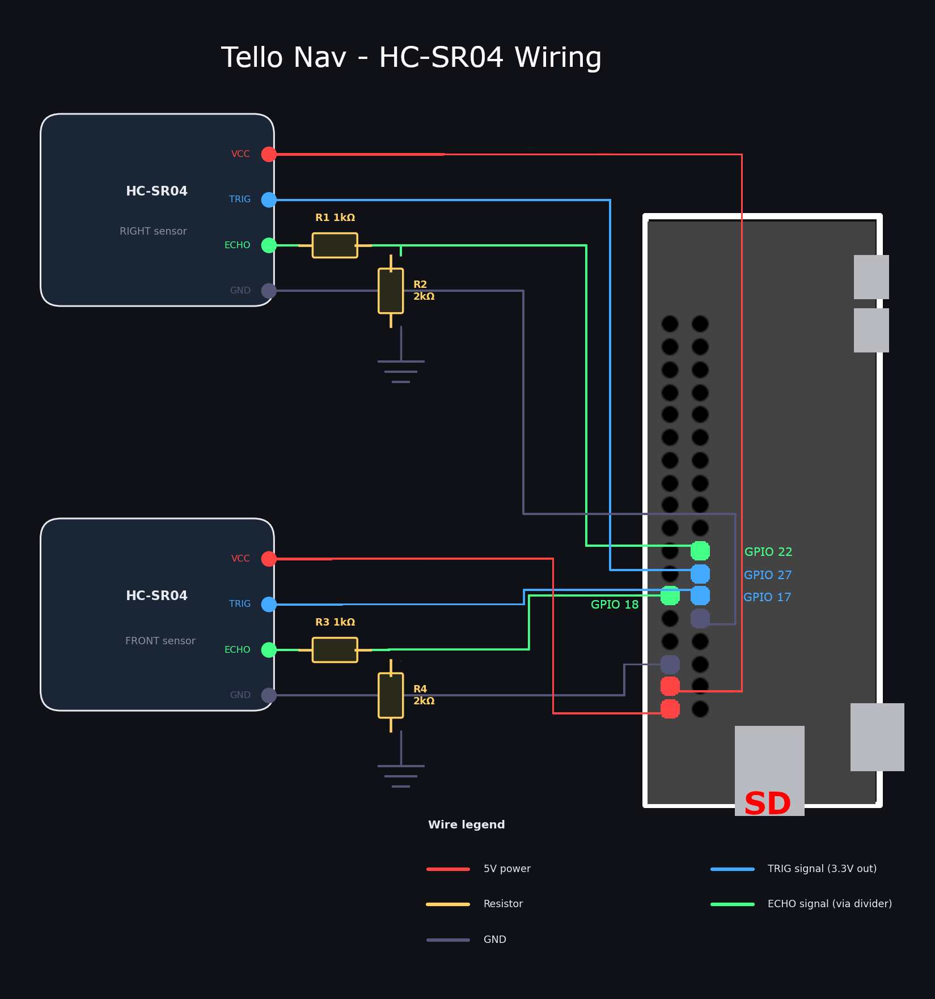
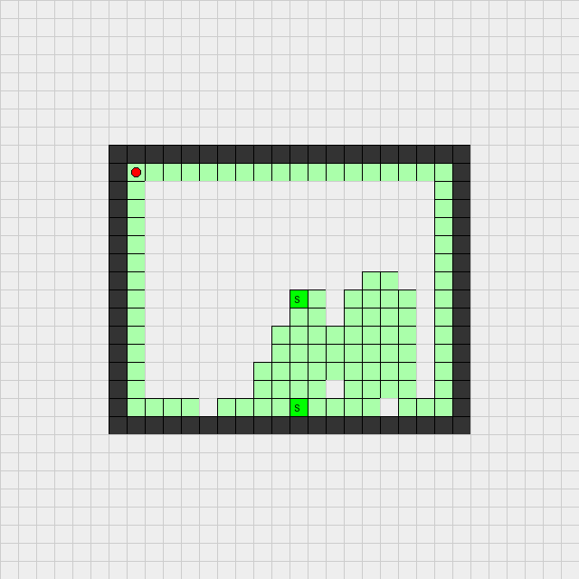

# Tello Navigator – Autonomous Room Mapping



Autonomous room mapping system using a DJI Tello drone and two HC-SR04 ultrasonic
sensors (front + right) running on a Raspberry Pi Zero 2W.

## How it works

The drone uses a **right-hand rule** wall-following algorithm:
- No wall on the right → turn right and move forward
- Wall ahead → turn left
- Wall on right, no wall ahead → move forward (follow the wall)

---

## Hardware

### Custom frame

The project uses a **fully custom 3D-printed frame** (`hardware/dron.stl`) that
replaces the original Tello chassis. The Tello motors, main PCB, and battery are
transferred into the new frame, which adds dedicated mounts for the sensors and
the Raspberry Pi Zero 2W.



| Axis | Size |
|------|------|
| X    | 120.5 mm |
| Y    | 120.0 mm |
| Z    |  56.0 mm |

Print settings: PETG or PLA+, 30–40% infill, 0.15–0.20 mm layer height,
supports enabled (sensor brackets). Full print notes in `hardware/README_hardware.md`.

### Assembly overview

1. Print `hardware/dron.stl`
2. Transfer Tello motors, PCB and battery into the new frame
3. Mount RPi Zero 2W on the dedicated slot
4. Insert HC-SR04 sensors into front and right brackets
5. Wire sensors to RPi GPIO (see pin table below)

### Components

- DJI Tello (motors + PCB + battery harvested from original frame)
- Raspberry Pi Zero 2W (64-bit Raspberry Pi OS Bullseye)
- 2× HC-SR04 ultrasonic sensor (front + right)
- USB keyboard + USB-A OTG adapter (for headless setup)
- USB drive with project files and pre-downloaded wheels

### GPIO pin mapping

| Sensor | TRIG | ECHO |
|--------|------|------|
| Front  | 17   | 18   |
| Right  | 27   | 22   |

### Wiring diagram




**Important — voltage divider on ECHO lines:**
The HC-SR04 outputs 5V on the ECHO pin, but the RPi Zero GPIO pins are 3.3V only.
Connecting 5V directly will damage the RPi. Each ECHO line requires a voltage divider:

```
HC-SR04 ECHO (5V) ──[ R1 1kΩ ]──┬──► GPIO (3.3V)
                                │
                             [ R2 2kΩ ]
                                │
                               GND

```

TRIG lines do **not** need a divider — RPi outputs 3.3V which is sufficient to
trigger the HC-SR04. VCC must be connected to 5V (not 3.3V).

---

## Full setup guide (offline / headless)

Since the RPi Zero 2W connects to the Tello drone over Wi-Fi, it has no internet
access during flight. All installation must be done **offline from a USB drive**.
The steps below walk you through everything — from your PC to first flight.

---

### PART 1 — On your PC: prepare the USB drive

#### 1.1 Download wheel files

Run this once on any computer **with internet access**:

```bash
python download_wheels.py
```

This creates a `wheels/` folder with all `.whl` files compiled for
`aarch64 / Python 3.9` (RPi Zero 2W + Bullseye 64-bit).

#### 1.2 Copy the project to a USB drive

Copy the entire project folder to your USB drive:

```
/usb-drive/
└── tello-mapper/
    ├── main.py
    ├── requirements.txt
    ├── download_wheels.py
    ├── start_on_boot.sh
    ├── wheels/               ← generated above
    │   ├── djitellopy-*.whl
    │   ├── numpy-*.whl
    │   └── ...
    ├── config/
    │   └── settings.yaml
    ├── drone/
    ├── mapping/
    └── sensors/
```

---

### PART 2 — On the Raspberry Pi: initial setup (keyboard required)

Connect a USB keyboard via OTG adapter and power on the RPi.
Log in with the default credentials (`pi` / `raspberry` or whatever you set
during OS installation).

#### 2.1 Mount the USB drive

```bash
# Find the USB drive device (usually /dev/sda1)
lsblk

# Mount it
sudo mkdir -p /mnt/usb
sudo mount /dev/sda1 /mnt/usb
```

#### 2.2 Copy project to the RPi

```bash
cp -r /mnt/usb/tello-mapper /home/pi/tello-mapper
cd /home/pi/tello-mapper
```

#### 2.3 Create a virtual environment (recommended)

A virtual environment keeps the project dependencies isolated.
On Bullseye it is optional but strongly recommended to avoid conflicts.

```bash
python3 -m venv venv
source venv/bin/activate
```

> **Note:** Every time you open a new terminal session, re-activate the venv:
> `source /home/pi/tello-mapper/venv/bin/activate`

#### 2.4 Install dependencies from wheels (no internet needed)

```bash
pip install --no-index --find-links=wheels/ -r requirements.txt
```

The `--no-index` flag tells pip to use **only** the local `wheels/` folder —
no internet connection required.

Verify everything installed correctly:

```bash
pip list
```

You should see `djitellopy`, `gpiozero`, `RPi.GPIO`, `numpy`, `Pillow`, `PyYAML`.

---

### PART 3 — Sensor test (before connecting to Tello)

**Run this with the RPi connected to your home Wi-Fi or directly (no Tello needed).**
This verifies that both HC-SR04 sensors are wired correctly and returning valid
readings — before you ever power on the drone.

```bash
cd /home/pi/tello-mapper

# Make sure venv is active
source venv/bin/activate

# Standard test — 10 readings, then pass/fail result
python3 sensors/test_sensors.py

# More readings
python3 sensors/test_sensors.py --rounds 20

# Continuous live stream (useful for checking distance accuracy)
python3 sensors/test_sensors.py --continuous
```

Expected output (both sensors working):

```
Pins loaded — Front: TRIG=17 ECHO=18 | Right: TRIG=27 ECHO=22

==================================================
INITIALIZING SENSORS
==================================================
FRONT: OK (Trig=17, Echo=18)
RIGHT: OK (Trig=27, Echo=22)
==================================================

[ 1/10]  Front:   42.3 cm  |  Right:   18.7 cm  OK
[ 2/10]  Front:   42.1 cm  |  Right:   18.9 cm  OK
...
RESULT: PASSED  (10/10 readings valid)
```

If you see `ERROR` for a sensor, check:
- 5V / GND wiring
- TRIG and ECHO pins match `config/settings.yaml`
- No short circuits on the breadboard

---

### PART 4 — Flight

#### 4.1 Connect RPi to Tello Wi-Fi

Power on the Tello drone. Connect the RPi to its Wi-Fi network:

```bash
sudo nmcli dev wifi connect TELLO-XXXXXX
```

Replace `TELLO-XXXXXX` with your drone's actual SSID (printed on the drone body).

Confirm connection:

```bash
ping 192.168.10.1
```

#### 4.2 Run the mapping mission

```bash
source venv/bin/activate
cd /home/pi/tello-mapper

# Interactive mode — asks for confirmation before takeoff
python3 main.py

# Fully automatic — no prompts, suitable for autostart
python3 main.py --auto-start

# Save final map to a custom path
python3 main.py --auto-start --save-map /home/pi/maps/room.png
```

Press `Ctrl+C` at any time to safely interrupt — the drone will land.

---

## Autostart on boot

To launch the mapping mission automatically every time the RPi powers on,
first update `start_on_boot.sh` to activate the venv:

```bash
nano /home/pi/tello-mapper/start_on_boot.sh
```

Make sure it looks like this:

```bash
#!/bin/bash
sleep 30  # Wait for Wi-Fi to connect
cd /home/pi/tello-mapper
source venv/bin/activate
python3 main.py --auto-start
```

Then register it in crontab:

```bash
chmod +x start_on_boot.sh
crontab -e
```

Add this line at the bottom:

```
@reboot /home/pi/tello-mapper/start_on_boot.sh
```

---

## Project structure

```
.
├── main.py                  # Main navigation logic (TelloNavigator)
├── requirements.txt         # Python dependencies
├── download_wheels.py       # Run on PC to download .whl files for RPi
├── start_on_boot.sh         # Autostart script (via crontab)
├── config/
│   └── settings.yaml        # GPIO pins, thresholds, paths
├── drone/
│   ├── tello_controller.py  # Drone control wrapper (djitellopy)
│   └── state_manager.py     # Flight state persistence (JSON)
├── mapping/
│   └── grid_map.py          # Grid map + PNG export
├── sensors/
│   ├── hcsr04.py            # HC-SR04 driver (gpiozero)
│   └── test_sensors.py      # Standalone sensor diagnostics
└── wheels/                  # (generated) offline .whl packages
```

---

## Output files

Saved to `/home/pi/tello_data/` by default (configurable in `settings.yaml`):

| File | Description |
|------|-------------|
| `final_map_TIMESTAMP.png` | Final room map image |
| `stats_TIMESTAMP.json` | Flight statistics |
| `checkpoint_TIMESTAMP.json` | Auto-saved state every 5 steps |



---

## Key configuration (`config/settings.yaml`)

| Key | Default | Description |
|-----|---------|-------------|
| `drone.max_flight_time_sec` | `600` | Hard limit on flight duration |
| `sensors.obstacle_threshold_cm` | `35` | Distance at which a wall is detected |
| `sensors.max_turn_attempts` | `3` | Max consecutive left turns before abort |
| `mapping.cell_size_cm` | `25` | Grid resolution in cm |
| `mapping.max_room_cm` | `800` | Maximum room dimension |
| `mapping.max_laps` | `2` | Stop after N full laps around the room |
| `paths.save_dir` | `/home/pi/tello_data` | Output directory |

---
## Power supply for RPi

I used two Gaoneng 300 mAh LiPo batteries connected in parallel with a PH2.0 
connector, boosted to 5V via a step-up converter to power the RPi, giving 
600 mAh total. 
Due to the step-up converter efficiency (~85%), the effective runtime is approximately 45–50 minutes. 
You could consider using a small, lightweight power bank (1000 mAh would be a good choice for ~1.5 hours 
of runtime, but remember - lighter = better).
> REMEMBER: If you use two batteries in parallel, they must be at the same voltage level before connecting. A significant voltage difference may damage the batteries or the RPi.